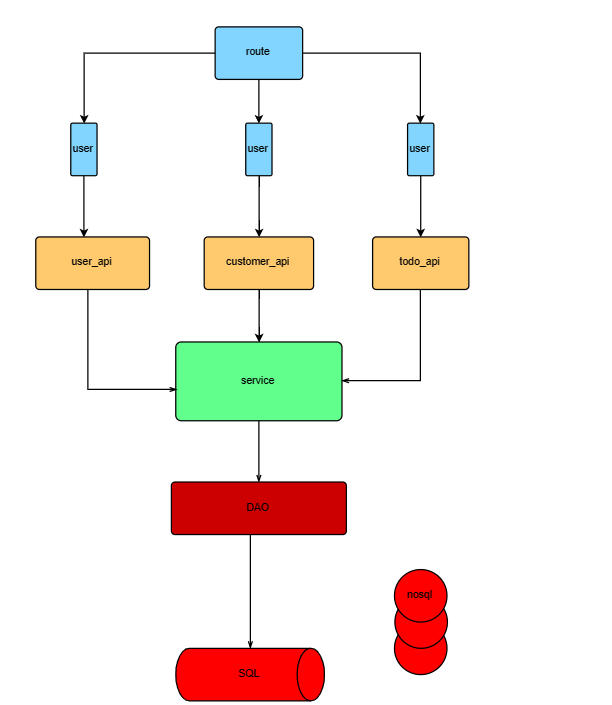

# 项目名称: bluebell

## 项目大概流程

### 项目功能
- 基本实现帖子的`CRUD`的功能，帖子ID使用生成器生成。
- 实现用户登录和注册功能，用户ID使用生成器生成。
- 基于`redis`实现帖子的时间排序和投票分数排序。
- 基于`redis`实现帖子的投票功能，对于帖子投票进行分数统计和排名
- 实现社区的查找和增加功能。
- 实现根据社区对于帖子的时间排序和投票分数排序。

### 项目技术
- 实现了优雅关机，在程序结束后有三秒时间处理期间请求。
- 使用`gin`作为轻量级web服务框架进行开发
- 使用第三方库`zap-logger`更换了go中原生的logger,自定义了日志格式并通过日志分割将日志进
行打印到`bluebell.log`文件中.
- 使用第三方库`viper`来管理配置文件信息
- 使用第三方库`sqlx`作为数据库的操作工具，将查询速度加快.
- 使用第三方库`JWT`作为用户认证管理中间件，并搭配`redis`实现同一时间内单个用户登录的限制
,使用`atoken和rtoken`方式同步刷新token，实现token的续约.
- 使用第三方库`ratelimit`作为限流中间件，限制突发情况下大规模的请求,避免导致服务器崩溃的情况
- 使用错误包对错误进行管理，并且定义专门的响应流处理响应。
并且使用第三方库`validator`对部分字段进行空值校验，确保参数的正确接收以及相应的中英文返回。

### 使用了redis和mysql进行数据的管理
#### 项目的数据库配置文件在conf包下
- 有`json`和`yaml`两种格式进行配置
